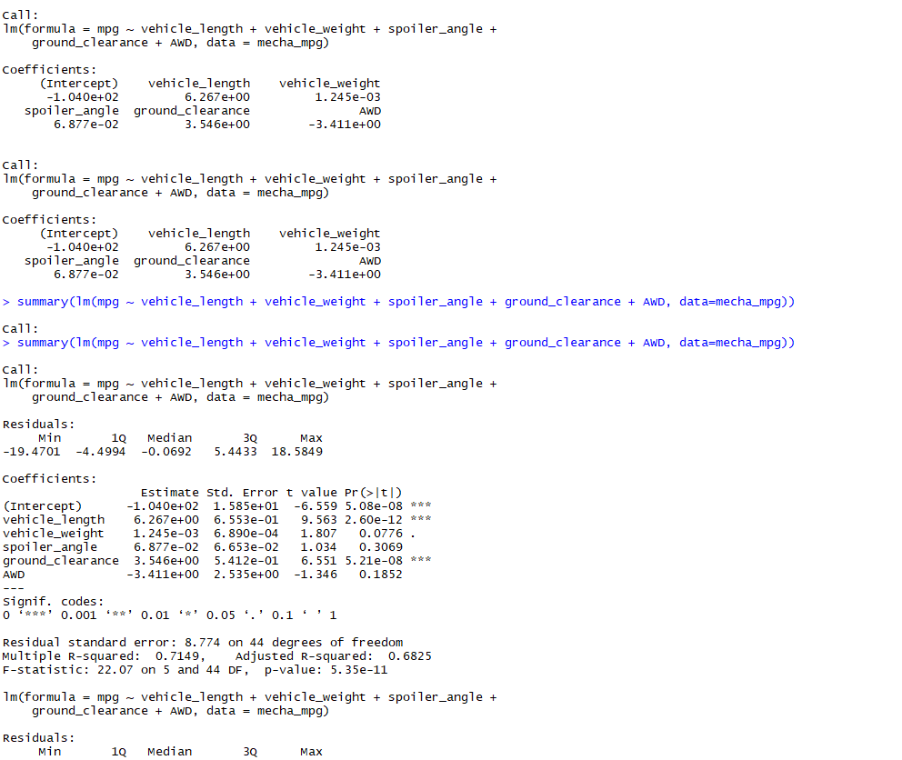
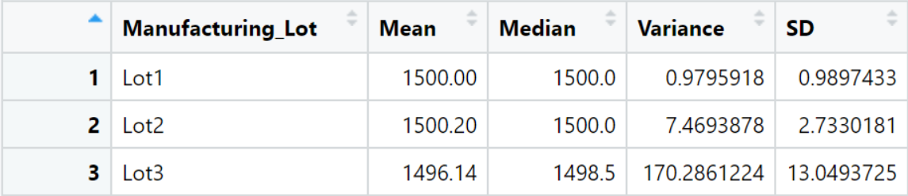
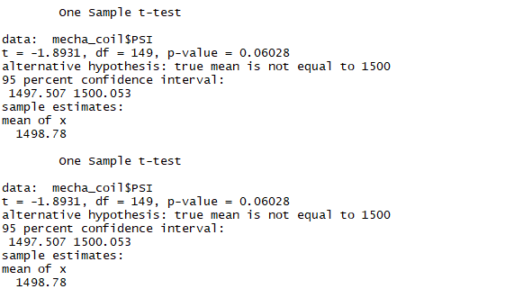
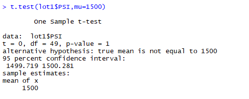

# MechaCar_Statistical_Analysis
## Overview
### The objective of this project is to perform a statistical analysis on all of the used cars owned by the car lot MechaCar. Using RStudio, I was able to load and clean .csv files given by MechaCar on their vehicles, design a linear model that predicts the mpg of MechaCar prototypes using variables from our cleaned data, measure PSI metrics for each lot, determine the differences between all car lots using a population mean of 1,500 pounds per square inch, and compare the performance of the MechaCar vehicles against vehicles from other manufacturers.
## Linear Regression to predict MPG
### Our MechaCar dataset contains a compiled list of 50 prototypes to measure average miles per gallon using multiple variables such as vehicle length, vehicle weight, spoiler angle, ground clearance, and AWD.

* The most significant variables in our dataset which show a non-random effect on the MPG of the MechaCar are the Vehicle Length and the Ground Clearance. 
* The slope of the linear model can not be considered to be zero, as the p-value is lower than the significance level, providing evidence that the null hypothesis must be rejected. 
* The r-squared value of 0.7149 which indicates that the model is approximately 71.5% accurate. We can deduce that this model is fairly efficient in predicting MPG for MechaCar prototypes.
## Summary Statistics on Suspension Coils
### Below is the summary statistics of all manufacturing lots.

### Below is the summary of these statistics by Lot number.

### The design specifications for the MechaCar suspension coils dictate that the variance of the suspension coils must not exceed 100 pounds per square inch. The current manufacturing data meets this design specification for all manufacturing lots in total. Lots 1 and 2 meet the specification. Lot 3 does not. Lots 1 and 2 had variances of 0.98 and 7.5 psi. Lot 3 has a variance of 170.3, which exceeds the 100 pounds per square inch specification.
## T Tests on Suspension Coils
### Our null hypothesis is that there is no statistical difference between the sample mean and the hypothetical population mean of 1500. 
### Below is the cumulative T Test on Suspension Coils in all lots. Based on our p-value, we can not reject the null hypothesis as the value is not low enough.  

### Below is the T Test performed for Lot 1. The p-value for Lot 1 is 1 which is not low enough to reject the null hypothesis.

### Below is the T Test performed for Lot 2. Our p-level of 0.6072 is not low enough to reject the null hypothesis.
![deliverable3lot2.png](images/deliverable3lot2.png
### Below is the T Test performed for Lot 3. Our p-level of 0.0417 is low enough to reject the null hypothesis and therefore we can conclude that the PSI across Lot 3 is statistically different from the population mean. Lot 3 may need to be evaluated further. 
## Study Design: MechaCar vs. Competition
### In order to perform a study to compare the performance of MechaCar automobiles versus its competition, we should consider metrics such as cost, fuel efficiency, car color, safety rating, maintenance cost, or horsepower. 
* Metrics to test would be safety rating which would cater to the consumer's needs.
* Our null hypothesis for testing the metrics would be that the safety rating is equal to 0, meaning it is unsafe. The alternative hypothesis would be that the safety rating is anything above zero, meaning the vehicle is completely or moderately safe to drive. 
* Using a multiple variable linear regression model to summarize our statistical analysis based on safety ratings data, we can see how MechaCar automobiles' safety ratings fare to its competitor.
* The data we would need would be a compiled list of the safety ratings of all MechaCar prototypes and the prototypes of its competitor.
