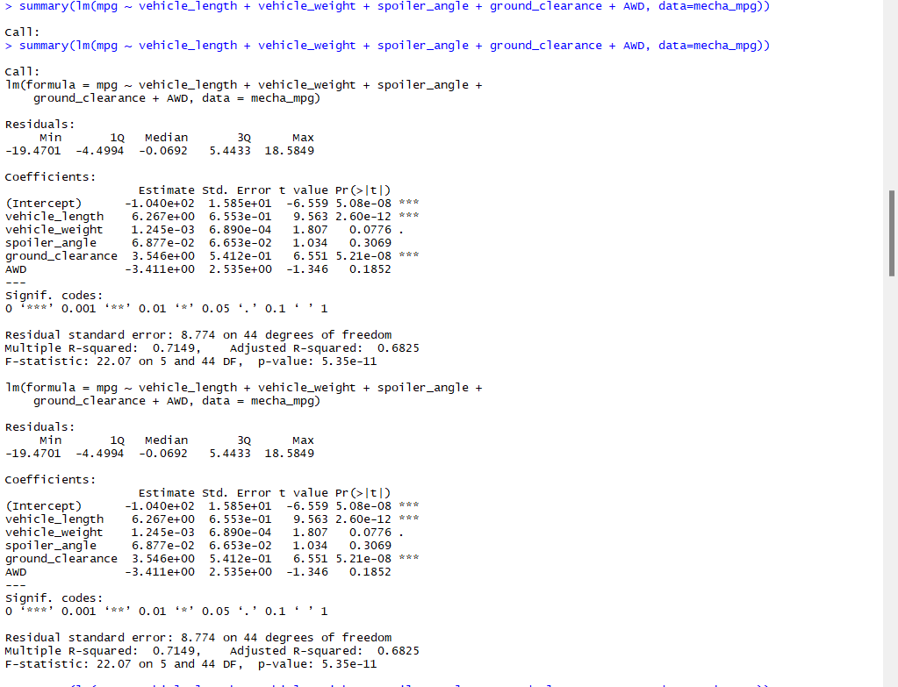

# MechaCar_Statistical_Analysis
## Overview
### The objective of this project is to perform a statistical analysis on all of the used cars owned by the car lot MechaCar. Using RStudio, I was able to load and clean .csv files given by MechaCar on their vehicles, design a linear model that predicts the mpg of MechaCar prototypes using variables from our cleaned data, measure PSI metrics for each lot, determine the differences between all car lots using a population mean of 1,500 pounds per square inch, and compare the performance of the MechaCar vehicles against vehicles from other manufacturers.
## Linear Regression to predict MPG
### Our MechaCar dataset contains a compiled list of 50 prototypes to measure average miles per gallon using multiple variables such as vehicle length, vehicle weight, spoiler angle, ground clearance, and AWD.

* The most significant variables in our dataset which show a non-random effect on the MPG of the MechaCar are the Vehicle Length and the Ground Clearance. 
* The slope of the linear model can not be considered to be zero, as the p-value is lower than the significance level, providing evidence that the null hypothesis must be rejected. 
* The r-squared value of 0.7149 which indicates that the model is approximately 71.5% accurate. We can deduce that this model is fairly efficient in predicting MPG for MechaCar prototypes.
